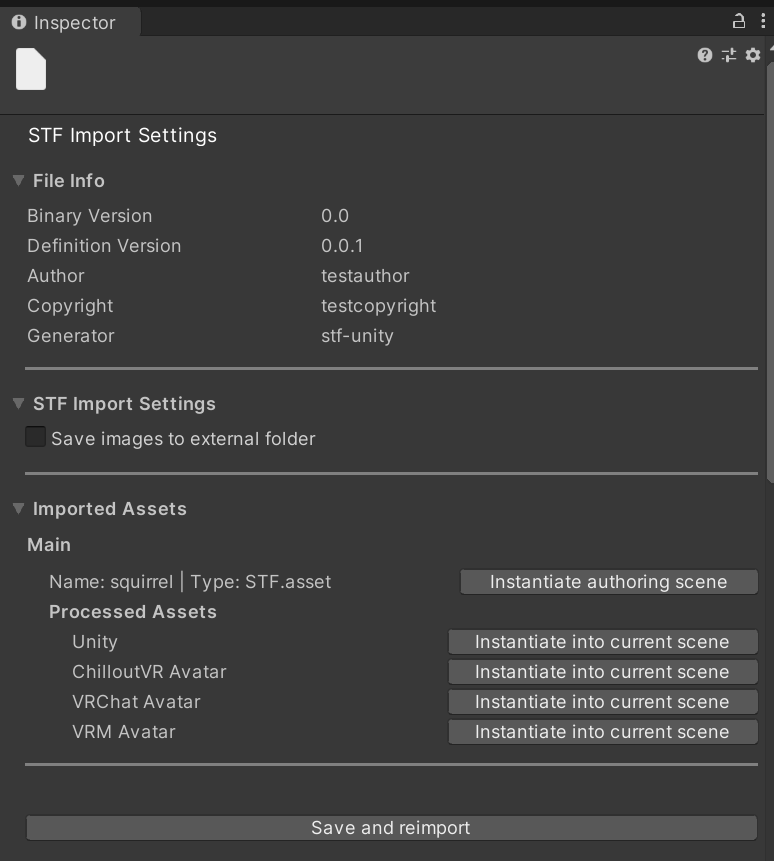

# AVA Format
**A Set of Extensions for the [STF Format](https://github.com/emperorofmars/stf-unity) to Represent VR & V-Tubing Avatars**

**This is a proof of concept!**

## [Watch the video presentation here!]()

## Table of Content
- [General Description](#general-description)
- [How to Use](#how-to-use)
- [AVA Format](#ava-format)
	- [Components](#components)
	- [Resources](#resources)

## General Description

The AVA project is a set of hot-loadable extensions for the [STF format](https://github.com/emperorofmars/stf-unity) in Unity to represent the various components that make up Avatars for Social-VR and V-Tubing applications.
It contains a set of converters for specific targets like VRChat, VRM and ChilloutVR.

I used this project to test and develop the capabilities of the [STF format](https://github.com/emperorofmars/stf-unity).

This is very experimental, i tried various things for each component. As such using this will be a very inconsistent and half broken experience.

Most components are only partly implemented without too much thought.

For now, this exists only to show that this is possible and realistic.

## How to Use
- Ensure you have the Newtonsoft JSON package imported in Unity. If you set up your Unity project with the VRC Creator Companion, it will be already imported. If not, install the official package in UPM.
- Either:
	- Download the latest release, which contains this set of extensions and the base STF implementation, and import the .unitypackage into Unity.
	- Or clone the [STF Unity](https://github.com/emperorofmars/stf-unity) and then this repository into the 'Assets' folder of your Unity project.
- Ensure that you have either a current VRChat SDK, ChilloutVR SDK or the UniVRM SDK in the version 0.89.0 (The same version that is required for the VSeeFace SDK).
- If you have an STF file with AVA components correctly set up, you can just import it. Its UI will give you the option to spawn a ready to upload VRChat, ChilloutVR or VRM avatar. It will give you the option to spawn it only if you have the appropriate SDK included.

## AVA Format
Most functionality of avatars in applications like VRChat, ChilloutVR or the VRM format is either nearly identical or very similar. Some of these applications may have features that another doesn't, but generally they work nearly the same.

This project intends to provide components which represent such data and converters to all these target applications.

### Components
#### Currently the following general components are included:
- `AVA.avatar`
	The presence of this component signifies that it is indeed an avatar. It must sit on a root node. This alone is enough to convert it to most targets (Not VRM, ill cry if i can't have an avatar be a non-humanoid 2d plane with the Sax-Gandalf meme on it).

	It also contains the position of the viewport and the viewport parent node.
- `AVA.humanoid_mappings`
	Maps bone-instances to the Unity and VRM humanoid model. Will make avatars move with IK in all target applications.
- `AVA.eye_bone_limits_simple`
	Defines how far eye-bones can rotate. Requires for the eye rotation to be controlled by bones.

	Extends `AVA.avatar` and `AVA.humanoid_mappings`.

	It's called simple because it defines limit in a simpler manner than most target applications. This would be sufficient for most models that i have ever seen.
- `AVA.avatar_voice`
	The position of the voice emitter and its parent node. Currently, only ChilloutVR has such a characteristic.

	Extends `AVA.avatar`.
- `AVA.facial_tracking_simple`
	A list of blendshapes for facial expressions including visemes. Converts to all targets.
	Currently, these are only blendshape mappings. Blendshapes only is a bad way to do things. When this is replaced with a more proper component, it should support animation states instead of only blendshapes, and use that only as a fallback method.
	
	Extends `AVA.avatar`.

	*This component is very incomplete and made without much thought. Proof of concept only!*
- `AVA.janky_fallback_physics`
	Extremely simplified representation of bone physics. Converts to all targets.

	*This component is very incomplete and made without much thought. Proof of concept only!*
- `AVA.expressions_simple`
	A simplified way to define an avatar's runtime features. This includes hand gestures, toggles and puppets.
	Currently, only hand gestures actually get converted.

	The idea is that most of an avatar's functionality are representable as simple definitions. This way they become more portable and future-proof as it should be very simple to parse these definitions into whatever format any application now or in the future will support.

	This should convert in a predictable manner, so that this component can be extended by a more complex but less portable one to support everything that this does not account for.

	If this component is remade with some proper thought put into it, it should support fallback functionality, so that targets like for example VRM, which support blendshape states only, can be supported.

	**Warning:** Using this component messes up the hand rotation in VR usage for some reason. I've not yet spent any time debugging that.

	Extends `AVA.avatar`.

	*This component is very incomplete and made without much thought. Proof of concept only!*
- `AVA.character-editor-setup`
	Exists only to visually showcase what would be possible with this format.

#### The following application specific components are included:
- `AVA.VRC.physbones`
	STF representation of VRChat Physbones. Only applies to VRChat.

	In case a `AVA.janky_fallback_physics` component targets the same bone, it should be overrided.

### Resources
For now no additional resource types have been implemented.

Good candidates would be blendtrees, 2d curves, color ramps and maybe state-machines.

---

Cheers!

